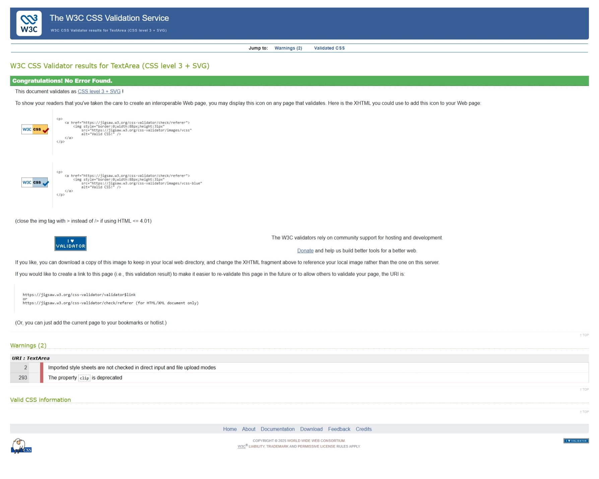
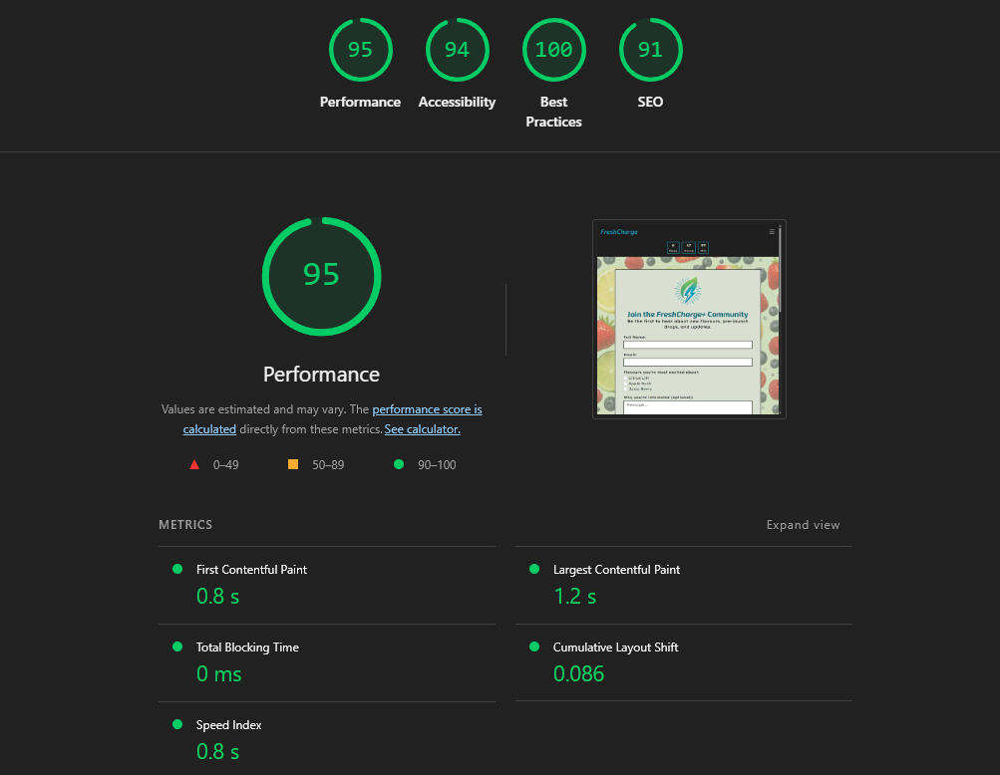

## Table of Contents

- [CSS Validation](#css-validation)
  - [CSS Validation Screenshot](#css-validation-screenshot)

- [HTML Validation](#html-validation)
  - [Home Page HTML Validation](#home-page-html-validation)
  - [Flavours Page HTML Validation](#flavours-page-html-validation)
  - [Community Page HTML Validation](#community-page-html-validation)
  - [Contact / FAQs HTML Validation](#contact--faqs-html-validation)

- [Lighthouse Performance Testing](#lighthouse-performance-testing)
  - [Home – Desktop Lighthouse](#home-lighthouse-desktop)
  - [Home – Mobile Lighthouse](#home-lighthouse-mobile)
  - [Flavours – Desktop Lighthouse](#flavours-lighthouse-desktop)
  - [Flavours – Mobile Lighthouse](#flavours-lighthouse-mobile)
  - [Community – Desktop Lighthouse](#community-lighthouse-desktop)
  - [Community – Mobile Lighthouse](#community-lighthouse-mobile)
  - [Contact / FAQs – Desktop Lighthouse](#contact-faqs-lighthouse-desktop)
  - [Contact / FAQs – Mobile Lighthouse](#contact-faqs-lighthouse-mobile)

---

## CSS Validation

The CSS stylesheet for the FreshCharge+ website was validated using the  
**W3C CSS Validator (CSS Level 3 + SVG)**:

https://jigsaw.w3.org/css-validator/#validate_by_input

The stylesheet passed validation with no CSS errors, confirming that the code is clean, accessible, and standards-compliant.

Two warnings were displayed, but they do not affect performance or rendering:

- Imported style sheets are not checked in direct-input mode  
- The `clip` property is deprecated  

These warnings are informational only and do not impact the final website.

### CSS Validation Screenshot

  

---

## HTML Validation

All HTML pages were validated using the  
W3C Markup Validation Service (Validate by Direct Input):  
https://validator.w3.org/nu/#textarea  

All four pages returned no HTML errors.

---

### Home Page HTML Validation

  

**Result:** No errors found  
**Validator:** W3C Validator (Direct Input)

---

### Flavours Page HTML Validation

  

**Result:** No errors found  
**Validator:** W3C Validator (Direct Input)

---

### Community Page HTML Validation

  

**Result:** No errors found  
**Validator:** W3C Validator (Direct Input)

---

### Contact / FAQs HTML Validation

  

**Result:** No errors found  
**Validator:** W3C Validator (Direct Input)

## Lighthouse Performance Testing

All four pages of the FreshCharge+ website were tested using Google Lighthouse in  
Chrome DevTools on both Desktop and Mobile views.

Across all tests:

- Accessibility, Best Practices and SEO stayed consistently high (mostly **90+**)
- Desktop performance scores were between **95–99**
- Mobile performance scores were slightly lower (due to large hero imagery) but remained in the **70–90** range

The screenshots below show the final Lighthouse reports for each page and device.

---

<h3 id="home-lighthouse-desktop">Home – Desktop Lighthouse</h3>

  

**Key scores (Desktop):**

- Performance: **95**
- Accessibility: **93**
- Best Practices: **100**
- SEO: **91**

---

<h3 id="home-lighthouse-mobile">Home – Mobile Lighthouse</h3>

  

**Key scores (Mobile):**

- Performance: **91**
- Accessibility: **93**
- Best Practices: **100**
- SEO: **91**

---

<h3 id="flavours-lighthouse-desktop">Flavours – Desktop Lighthouse</h3>

  

**Key scores (Desktop):**

- Performance: **95**
- Accessibility: **94**
- Best Practices: **100**
- SEO: **91**

---

<h3 id="flavours-lighthouse-mobile">Flavours – Mobile Lighthouse</h3>

  

**Key scores (Mobile):**

- Performance: **74**
- Accessibility: **94**
- Best Practices: **96**
- SEO: **91**

---

<h3 id="community-lighthouse-desktop">Community – Desktop Lighthouse</h3>

  

**Key scores (Desktop):**

- Performance: **95**
- Accessibility: **94**
- Best Practices: **100**
- SEO: **91**

---

<h3 id="community-lighthouse-mobile">Community – Mobile Lighthouse</h3>

  

**Key scores (Mobile):**

- Performance: **75**
- Accessibility: **94**
- Best Practices: **100**
- SEO: **91**

---

<h3 id="contact-faqs-lighthouse-desktop">Contact / FAQs – Desktop Lighthouse</h3>

  

**Key scores (Desktop):**

- Performance: **99**
- Accessibility: **95**
- Best Practices: **100**
- SEO: **91**

---

<h3 id="contact-faqs-lighthouse-mobile">Contact / FAQs – Mobile Lighthouse</h3>

  

**Key scores (Mobile):**

- Performance: **84**
- Accessibility: **95**
- Best Practices: **100**
- SEO: **91**

---

Overall, the Lighthouse results confirm that:

- The site is well-optimised on desktop, with excellent performance and standards compliance.  
- Mobile performance is slightly lower due to large imagery and rich visuals, but still within an acceptable range for a launch-style marketing site.  
- Accessibility, SEO, and best-practice scores remain consistently strong across every page.

